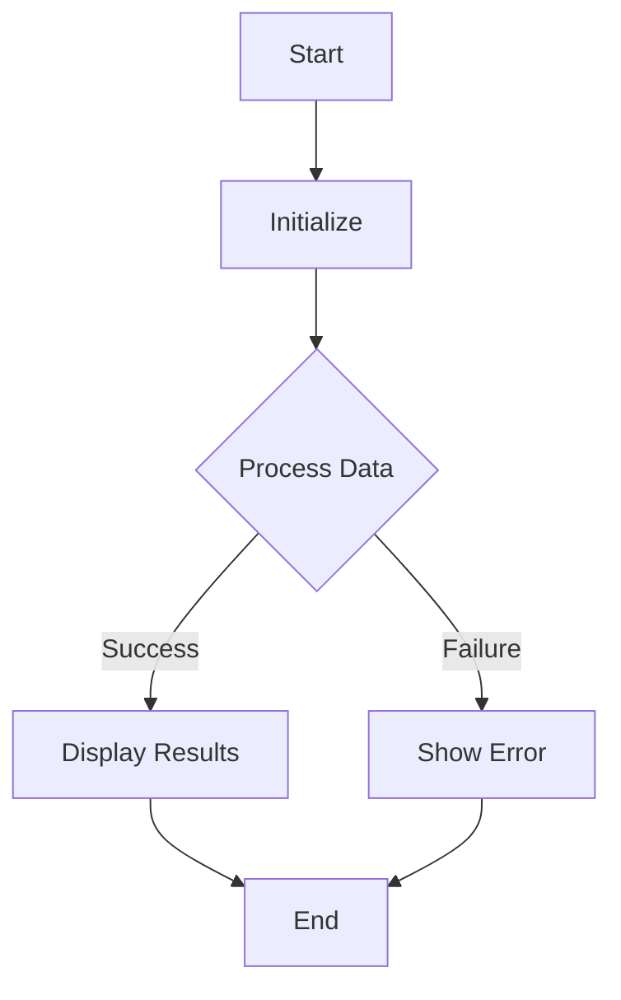

# 🤪 Welcome to the Amazing IEEE-Project!

## 💥 What's This Thing Anyway?
This project is a web application that combines computer vision using YOLO object detection with control of an ESP32 microcontroller, likely for a robotic or automation task. It provides a Flask-based web interface for interacting with the system, including camera selection, object detection visualization, and ESP32 servo control testing. The project also includes diagnostic tools for troubleshooting ESP32 serial communication.
Spoiler alert: It's awesome!

## 🎉 Cool Stuff It Does
- Webcam scanning to identify available cameras and their indices.
- Real-time object detection using YOLO via a live camera feed.
- ESP32 serial port diagnostics to identify and resolve connection issues.
- Servo control testing functionality for the ESP32 microcontroller.
- Flask web server for user interaction and visualization of results.
- Performance testing of CUDA-accelerated YOLO detection.
And probably more that we forgot to mention!

## 🔧 Nerdy Bits & Bytes
- Python
- Flask
- OpenCV (cv2)
- YOLO (likely Darknet or a YOLOv5/v8 implementation)
- PySerial
- CUDA (for GPU acceleration)
- serial.tools.list_ports
All perfectly glued together with developer tears!

## 🧙‍♂️ Getting This Baby Running

```bash
# Let's do this!
git clone https://github.com/[username]/IEEE-Project.git
cd IEEE-Project
# Magic installation incantations go here
```

Don't worry, it won't bite... much.

## Detailed Setup

1. Install Python 3.7+.
2. Install required packages: `pip install flask opencv-python pyserial` (and potentially CUDA-related packages if GPU acceleration is desired).
3. Ensure a webcam is connected and accessible.
4. If ESP32 functionality is desired, install the necessary drivers and configure the serial port.
5. Clone the repository and run `python app_flask.py` or `python app.py` to start the web server.
6. Access the web application in a browser (typically at http://127.0.0.1:5000).

## Configuration

Adjust the configuration based on your environment requirements.

## Development

Guidelines for further development and contributing to this project.


## 🎮 How To Actually Use This Thing

Point, click, and pray it works! Just kidding, this is actually quite reliable.

## 📜 The Story Behind This Masterpiece

This repo was born when someone looked at [anshc022/IEEE-Project](https://github.com/anshc022/IEEE-Project) and thought "I can make this better!" using GitShowcase.
- **Complexity Level**: 7/10 (where 10 is "only a genius can understand this")
- **Approach**: A minimal version would focus on the core functionality: live camera feed and basic object detection.  Remove the ESP32 interaction entirely. Start with `simple_live_cam.py` as a base. Integrate a pre-trained YOLO model (e.g., a small YOLOv3 model) into the live camera feed to display bounding boxes around detected objects.  Simplify the Flask app to just display the camera feed with detections.  Remove all testing and diagnostic scripts.  The goal is to have a functional web app showing a camera feed with object detection, without any microcontroller control. (fancy words for "we did it this way")

## 👻 High Fives To

The original awesome folks at [anshc022/IEEE-Project](https://github.com/anshc022/IEEE-Project)
The genius behind it all: anshc022

---
*Crafted with questionable humor by GitShowcase*


## Flow Diagram



## Code Example

```python
// Example usage

from lib import some_function

result = some_function(
    param1='value1',
    param2='value2'
)

print(f'Result: {result}')
```